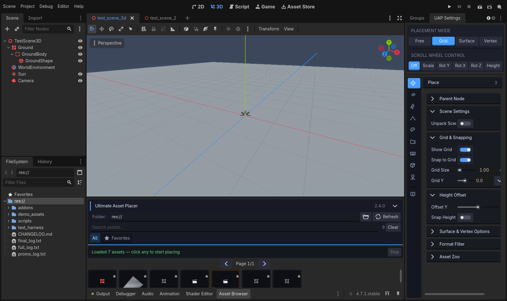
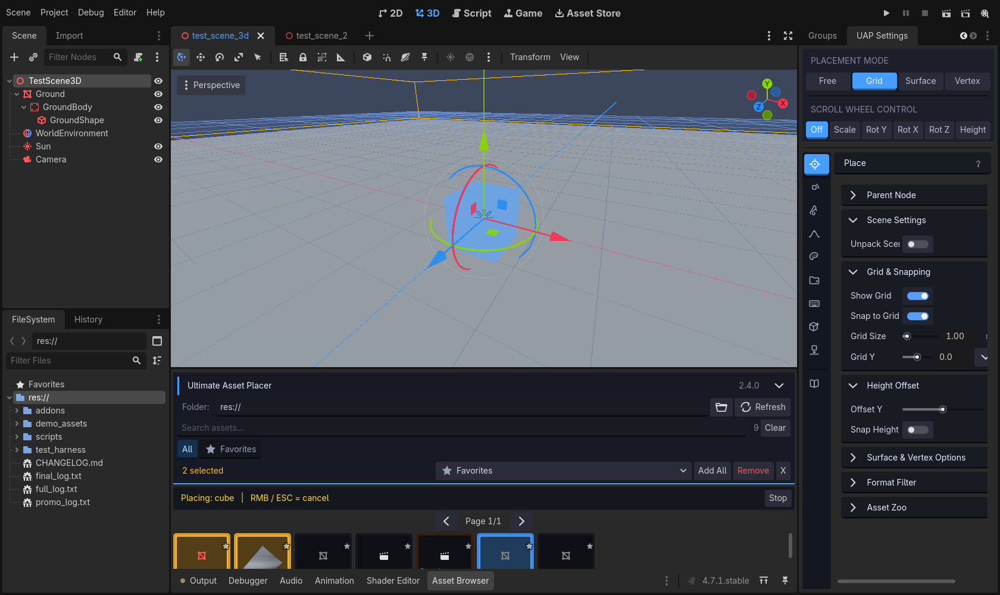
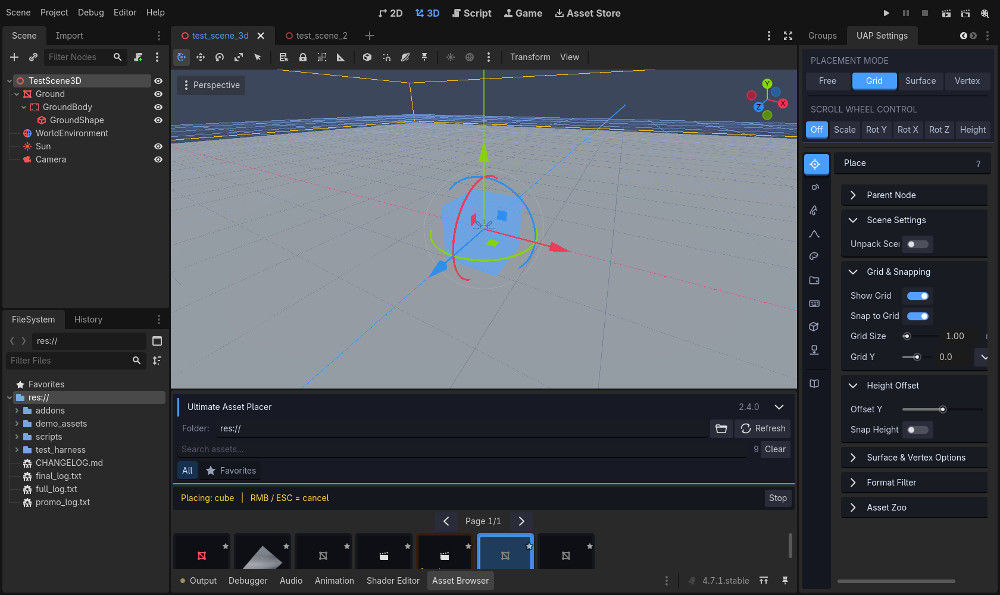
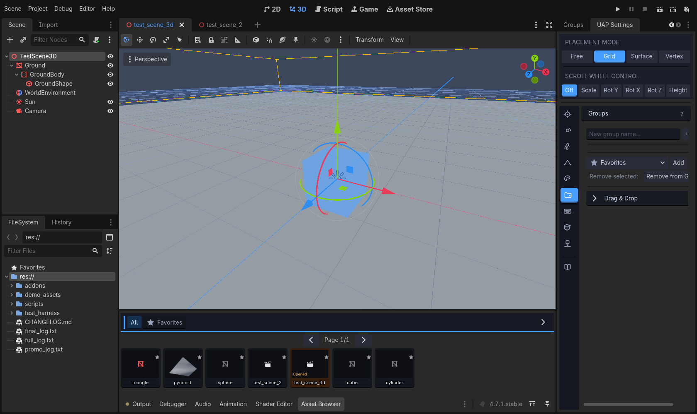
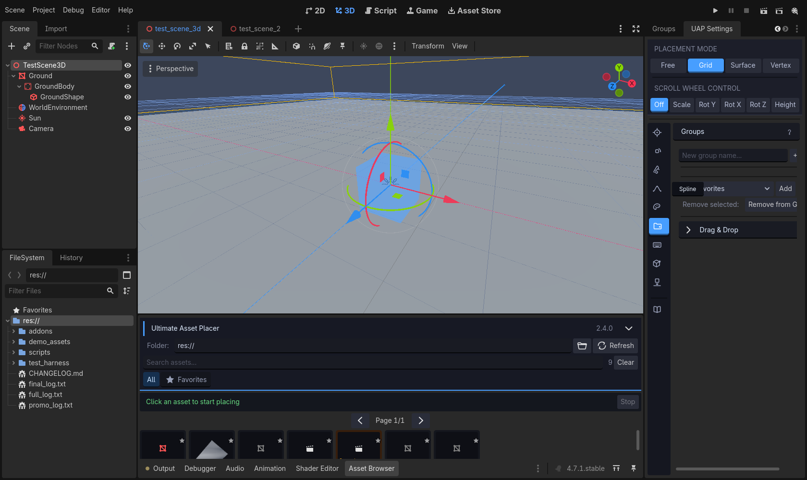
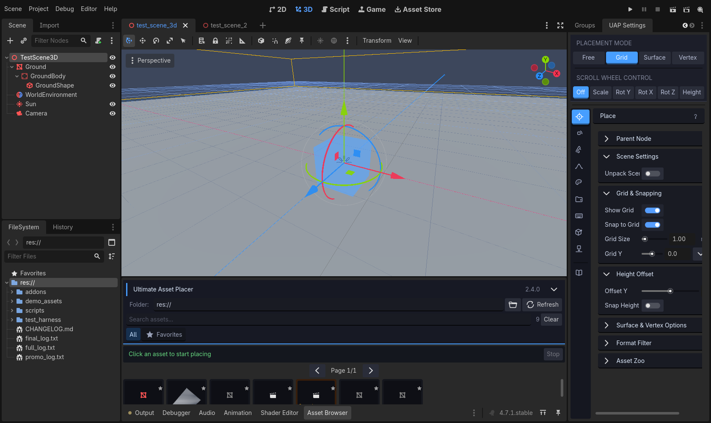
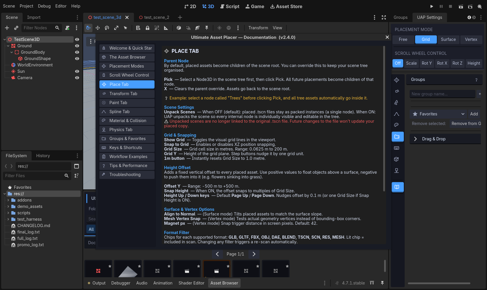
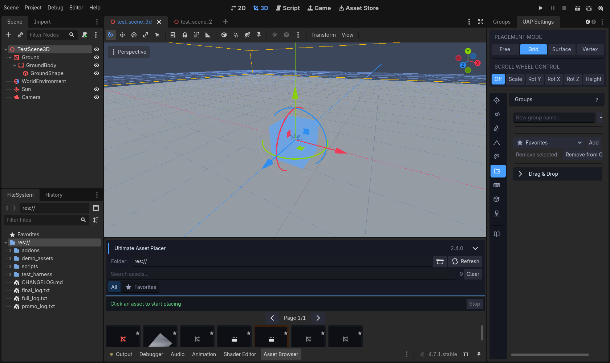
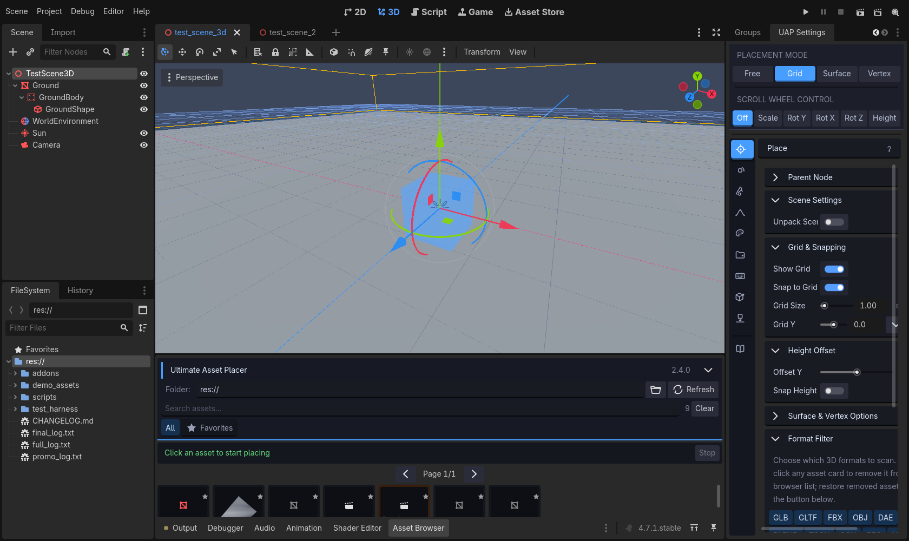

# Ultimate Asset Placer

**Professional 3D asset placement tool for Godot 4.7+** — place, paint, scatter, spline, and physics-drop your assets with a fast, tactile editor UI. Optimised for thousands of assets.

  



## Highlights

- **Four placement modes** — Free, Grid, Surface (physics raycast), and Vertex (mesh magnet snap).
- **Paint & volumetric brush** — drag-paint, circular brush with density/falloff, and mask textures.
- **MultiMesh painting** — thousands of instances in a single draw call.
- **Advanced spline system** — scatter props along curves or deform meshes into roads/rivers; terrain snapping; bake to nodes or MultiMesh.
- **Random transforms** — random rotation, tilt, and scale, per placement.
- **Groups & Favorites** — organise assets into named collections, random group placement.
- **Material override & auto collision** — Replace/Next-Pass materials, Static/Rigid/Character/Area bodies with five shape types.
- **Physics tab** — lift, drop, tumble and settle existing scene objects entirely inside the editor.
- **Asset Zoo** — lays out your whole library in a 3D grid for inspection.

## What's new in v2.4.0 — carved asset cards, Open Scene / View Model

- **Asset cards are now dark inset 3D.** Resting cards are carved into the
  panel exactly like the group chips — a clearly darker face with a single
  darker line along the bottom edge, no border on any other side. No more
  cards blending into the background.
- **Selection frames the thumbnail.** A selected card is raised in blue 3D
  and its thumbnail gets a **blue ring** on top of the blue tint; Ctrl/Shift
  multi-select does the same in amber. The active color reads AROUND the
  image, not just under it.
- **White card names with a black outline** for crisp legibility over any
  thumbnail (asset browser card names only).
- **"Opened" chip.** The scene that is currently open in the editor is
  marked with an amber "Opened" tag in the bottom-left corner of its
  thumbnail (and keeps its warm card tint).
- **Roomier rows.** The asset grid now keeps a clearly larger vertical
  margin between rows than between columns, so rows no longer read cramped.
- **Open Scene / View Model in the card context menu.** Right-click a single
  card to open that scene in the editor, or view a model: mesh resources
  (obj/mesh) and imported scene formats (glb/gltf/fbx/blend) are shown in
  the Inspector with an interactive 3D mesh preview.

## What's new in v2.3.0 — borderless cards, whole-card clicks, per-tab help

### Resting cards: no outline, period
Unselected asset cards are now a **clean solid dark surface with nothing drawn around them** — the thin border (and the "open scene" amber ring) are gone. The thumbnail sits on its carved dark well; nothing else competes for attention.

### Click anywhere on a card
Clicking a card's **thumbnail now selects it** — previously only the name row worked because the thumbnail well silently swallowed mouse clicks. Thumbnail, name or padding: the entire card is one big click target.

### Selection that reads around the thumbnail
- **Single selection** — the whole card raises in **blue 3D** (solid face, darker bottom bevel, drop shadow) and the **thumbnail well is tinted blue**, so the highlight wraps the image.
- **Multi-selection (Ctrl/Shift)** — the same raised 3D treatment in **amber**, with an amber-tinted well. No more flat highlight box.



### Help (i) button on every tab title bar
The tab-name bar now carries an **info button** that opens the documentation window **directly at that tab's chapter** — Place opens "Place Tab", Groups opens "Groups & Favorites", and so on.

### Every last bright control re-themed
A new global dressing pass sweeps the entire panel and themes anything the explicit styles missed: **Create Asset Zoo**, the Zoo **Source dropdown** (and its popup list), the group dropdown, key rebinding controls, LineEdits — the whole panel now speaks one visual language.

## What's new in v2.2.0 — polish pass

### Carved-in 3D groups (everywhere, one design)
All groups — section boxes, group chips, group rows — now share a single **carved-in** look: a fill clearly **darker than the panel**, **no outline border on any side**, and a single darker **line along the bottom edge** that makes the surface read as chiseled into the panel.


### Square asset cards with landscape thumbnails
Cards are now **perfectly square cells** with a **rectangular (landscape) thumbnail area** on top and the **name inside the card** at the bottom. The grid uses exact slot math, so cards **can never overlap or clip** again, and thumbnails keep their aspect ratio — never stretched, never cropped.



### Advanced header collapse — groups stay on the bar
The **Search & Filters sub-collapse is gone** (folder/search/groups are always visible while expanded). The master bar collapse got smarter: expanded it shows the "Ultimate Asset Placer" title; **collapsed it moves the group chips into the bar** so every group remains one click away in the slim state.



### Rail hover names + active tab title
Hovering a rail icon pops an **instant name label** (Place, Transform, Paint…) right next to the rail — no editor-tooltip delay. The **active tab's name is also written on a header bar on top of the tab panel**.



### No more dark text outline
Active button labels are plain near-white — the dark font outline around the text of the placement-mode and scroll buttons was removed.

## What's new in v2.1.0 — the "3D tactile" UI overhaul

### Tactile raised buttons
Every active control is now a **solid, raised 3D button** — full color, a darker bottom bevel, and a soft drop shadow. No semitransparency anywhere. Inactive buttons are clean flat dark with no harsh white highlight.

- Placement modes light up in their own color (Free grey / Grid blue / Surface green / Vertex yellow)
- Scroll Wheel Control's active target is highlighted blue — **including "Off"**, which previously had no visible active state



### Blender-style left feature rail
All nine feature pages live on a **vertical icon rail on the left edge of the panel** — like Blender's toolbar. Every feature is permanently one click away; no horizontal scrolling, no clipped tabs.

### Chapter-style Docs window
The Docs button opens a **dedicated documentation window in the center of the screen** with **15 clickable chapters** in a sidebar. Closing it returns you to exactly the feature page you were on.



### Right-click menu on asset cards
Right-click any card (or a whole multi-selection) to **add/remove favorites**, **add to any group**, or **remove assets from the browser list** (reversible — nothing is deleted from disk).



### Inset 3D groups
Group chips (All / Favorites / your groups) are recessed **into** the panel — darker than the panel, no border, with a dark bottom line; the active chip is a deep blue recess with a gold star for Favorites.



### Fixed favorite star overflow
The favorite star sits cleanly **inside** each card's top-right corner at every editor scale (it previously overflowed outside the card).


See [CHANGELOG.md](CHANGELOG.md) for the complete, detailed change history.

## Installation

### Option A — from a release zip
1. Download `ultimate_asset_placer_v2.4.0.zip` from the [Releases](../../releases) page.
2. Extract it into your project folder so you end up with `res://addons/ultimate_placer/`.
3. Open **Project → Project Settings → Plugins** and enable **Ultimate Asset Placer**.
4. The **Asset Browser** appears as a bottom panel and the **settings panel** docks to the right.

### Option B — this repository
Clone the repository and open it directly in Godot 4.7+ — the plugin is pre-enabled and a `demo_assets/` folder with sample `.obj` models and a 3D scene is included for a quick test drive.

## Quick start

1. Open (or create) a **3D scene**.
2. In the **Asset Browser**, point **Folder** at a directory containing your 3D assets (`GLB, GLTF, FBX, OBJ, DAE, BLEND, TSCN, SCN, RES, MESH`) and click **Refresh**.
3. **Left-click** a thumbnail card — a ghost preview follows your cursor in the viewport.
4. **Left-click** in the viewport to place. **Right-click / ESC** stops placing.
5. Everything is undoable with **Ctrl+Z**.

Tip: switch the scroll wheel target with the blue buttons (Scale, Rot Y/X/Z, Height — or Off), and use the **left rail** to reach any feature page in one click.

## Feature tour

| Area | What it does |
|---|---|
| **Placement modes** | Free, Grid, Surface, Vertex — switchable any time, even mid-placement |
| **Scroll Wheel Control** | Assign the wheel to Scale / Rot Y / Rot X / Rot Z / Height, or turn it off |
| **Place tab** | Parent node, grid snapping, height offset, format filter, hidden-asset restore, Asset Zoo |
| **Transform tab** | Rotation snap, live rotation sliders, 8 orient presets, random rotation/tilt/scale |
| **Paint tab** | Drag painting, volumetric brush with mask textures, Random Group Placer, MultiMesh painter |
| **Spline tab** | Curve scattering & mesh deformation, terrain snapping, bake to nodes or MultiMesh |
| **Material tab** | Automatic material override (Replace or Next Pass) |
| **Groups tab** | Named collections, folder import, smart multi-remove |
| **Keys tab** | Rebind every placement shortcut |
| **Collision tab** | Auto collision: 4 body types × 5 shape types |
| **Physics tab** | Editor-side physics simulation to drop and settle objects |
| **Docs button** | Opens the chapter-style documentation window |

## Documentation

The full manual ships inside the plugin — click the **Docs** button at the bottom of the left rail (the book icon) or the **(i) button on any tab's title bar** to jump straight to that tab's chapter. It covers every setting, all keyboard shortcuts, six workflow walkthroughs, performance notes, and a troubleshooting FAQ.

## System requirements

- **Godot 4.7 or newer** (standard build — no .NET required)
- Works with any project that can open a 3D scene
- HiDPI-ready: respects **Editor Settings → Interface → Editor Scale**

## Repository layout

```
├── addons/ultimate_placer/   # the plugin (drop this folder into any project)
│   ├── plugin.gd             # EditorPlugin entry point
│   ├── ultimate_panel.gd     # editor UI (browser, rail, tabs, docs window)
│   ├── ultimate_placer.gd    # placement engine
│   ├── uap_physics.gd        # editor-side physics simulator
│   ├── uap_path.gd           # advanced spline system
│   ├── uap_docs.gd           # chapter-based documentation source
│   ├── uap_icons.gd          # icon loader/cache
│   ├── uap_thumb_gen.gd      # offline thumbnail renderer
│   └── icons/                # flat SVG icon set
├── demo_assets/              # sample .obj models + a demo 3D scene
├── screenshots/              # images used in this README
├── CHANGELOG.md              # full version history
└── project.godot             # ready-to-open Godot 4.7 project
```

## Contributing & support

Found a bug or have a feature request? Open an issue here on GitHub. The plugin is also available on [itch.io](https://choco-ted.itch.io/ultimate-asset-placer-godot-45-gd-script).

## License

MIT — see [LICENSE](LICENSE).
